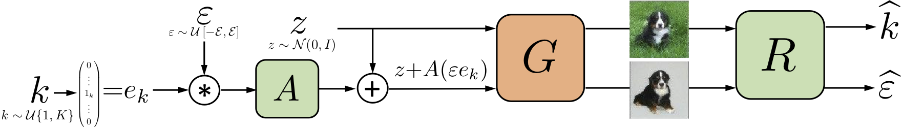
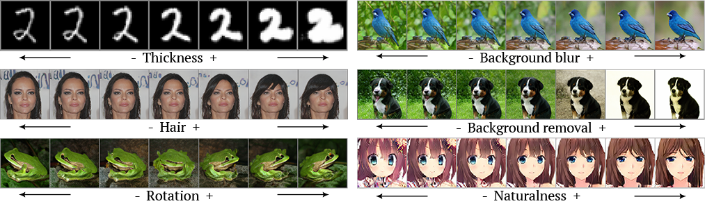

# Unsupervised Discovery of Interpretable Directions in the GAN Latent Space

PyTorch implementation of the ICML-2020 submission _Unsupervised Discovery of Interpretable Directions in the GAN Latent Space_.

This code explores interpretable latent space directions of a pretrained GAN.




Here are several examples for Spectal Norm GAN (MNIST & Anime Faces), ProgGAN (CelebA-HQ) and BigGAN (ILSVRC):



# How to run?
To get pretrained generators and latent space directions run ```download_pretrained.sh``` from the repository root.
Evaluation example is presented in ```evaluation.ipynb```

Run pretrained GAN latent space discovery with ```run_train.py```


# Credits
BigGAN code and weights are based on the authors implementation:
https://github.com/ajbrock/BigGAN-PyTorch

ProgGAN code and weights are based on:
https://github.com/ptrblck/prog_gans_pytorch_inference

U-net segmentation model code is based on:
https://github.com/milesial/Pytorch-UNet